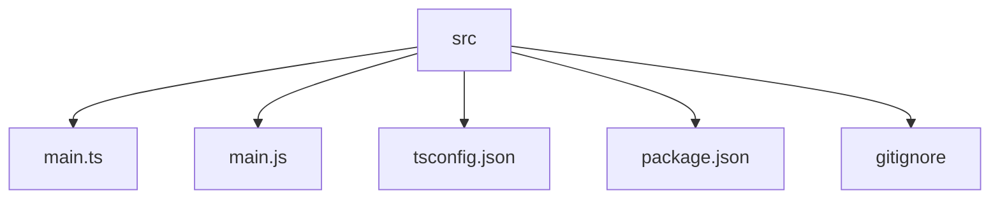

# CLI Todo List App 📝

## 🗂️  Description

The CLI Todo List App is a command-line interface application designed to help users manage their todo lists efficiently. This project is perfect for developers who want to stay organized and focused on their tasks. The app allows users to add, update, view, and delete todo items, providing a simple yet effective way to manage daily tasks.

## ✨ Key Features

### Core Features

*   **Add Todo Items**: Users can add new todo items with a description and optional due date.
*   **View Todo Items**: Users can view all todo items, including their status (pending or completed).
*   **Update Todo Items**: Users can update existing todo items, changing their description or due date.
*   **Delete Todo Items**: Users can delete todo items they no longer need.

### User Experience

*   **Interactive CLI**: The app provides an interactive command-line interface, making it easy for users to navigate and manage their todo lists.
*   **Infinite Loop**: The app runs in an infinite loop, allowing users to perform multiple actions without restarting the app.

## 🗂️ Folder Structure

## 🛠️ Tech Stack

## ⚙️ Setup Instructions

To run the CLI Todo List App locally, follow these steps:

*   **Clone the Repository**: Run `git clone https://github.com/ausafulislam/CLI-Todo-List.git` in your terminal.
*   **Install Dependencies**: Navigate to the project directory and run `npm install` to install the required dependencies.
*   **Build the App**: Run `npm run build` to compile the TypeScript code into JavaScript.
*   **Run the App**: Run `npm start` to start the app.

## 📝 GitHub Actions

The repository uses GitHub Actions to automate tasks such as building and testing the app. The workflow file is located in the `.github/workflows` directory.

## 📁 Files and Directories

*   **`.gitignore`**: Specifies files or directories that Git should ignore in the project.
*   **`package.json`**: Contains metadata for the project, including its name, version, description, main entry point, and dependencies.
*   **`main.js`**: The main entry point of the CLI Todo List application written in JavaScript.
*   **`main.ts`**: The main entry point of the CLI Todo List application written in TypeScript.
*   **`tsconfig.json`**: A configuration file for the TypeScript compiler.

  

<h3>Ausaf ul Islam</h3>

Software Developer, Tech Explorer, and Problem Solver with a passion for growing in computer science.

 

  <a href="https://gitfull.vercel.app">Made by GitFull</a>

    